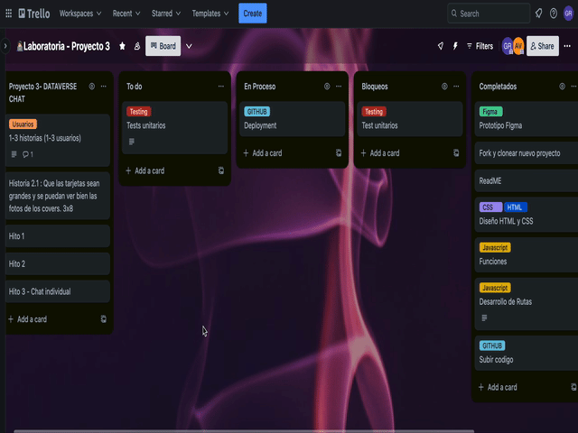

# Dataverse Chat

## 1. Resumen del proyecto

Construimos una Single Page Application (SPA) que permita, además de visualizar la data, filtrarla, ordenarla y calcular alguna estadística tal como se hizo en Dataverse, acceder a una página de detalle de cada personaje y poder interactuar con las peliculas mediante openAI.

Adicionalmente le agregamos dos botones que le permita al usuario acceder a estadisticas, una de ellas muestra el promedio y suma total de ingresos producidos por genero y la segunda muestra los premios ganados por genero y total.
 La interfaz es simple y facil de explorar para el usuario y los botones son faciles de visualizar. 

## 2. Funcionalidades

Parte de nuestro proyecto es cubrir los requerimientos que pide, entonces nuestro objetivos claro son: 
-Que se pueda visualizar la data
-La aplicación debe calcular y visualizar una estadística de la data.
-La aplicación debe permitir a la usuaria filtrar la data. 
-La aplicación debe permitir a la usuaria ordenar la data.
-La aplicación debe permitir a la usuaria reiniciar la aplicación, limpiando
  filtros y ordenamiento, con un `<button>` con un atributo de datos
  `data-testid="button-clear"`.
-Las operaciones de filtrar, ordenar, limpiar, etc. no deben recargar la página, si no que deben agregar el contenido en una manera dinámica via javascript.

-La aplicacion permite la interaccion con cada pelicula mendiante el uso de openAI
* La aplicación será _responsive_, es decir, debe visualizarse sin problemas
  desde distintos tamaños de pantallas: móviles, tablets y desktops.

### 3. Criterios de aceptación mínimos del proyecto

Nuestro proyecto cumple con los requerimientos que necesitamos para que el proyecto tenga la funcionalidad para que podamos procesar y manipular datos.
Por ejemplo:

* **Uso de HTML semántico**

  - [ ] Tiene un `<header>` con `<h1>`
  - [ ] Tiene un `<footer>`
  - [ ] Tiene un `<main>` con `<h2>`
  - [ ] Todas las etiquetas de controles (inputs, selects, radio, etc) tienen `<label>`
  - [ ] `<ul>` esta usado para dibujar la data
  - [ ] Los hijos de `<li>` usan attributos de microdata `itemscope` e `itemprop`

CSS

* **Uso de selectores de CSS**

  - [ ] Uso de selector class para los items <li>
  - [ ] Uso de flexbox en sentido `row` y `column`
  - [ ] Uso de flexbox para el elemento que contiene los items
  - [ ] Uso de flexbox para el elemento que contiene los UI inputs

Web APIs

* **Uso de selectores del DOM**

  - [ ] La aplicación usa [`querySelector`](https://developer.mozilla.org/en-US/docs/Web/API/Document/querySelector)
    para buscar los elementos del DOM
  
* **Manejo de eventos del DOM (listeners, propagación, delegación)**

  - [ ] `addEventListener` con callback que tiene parámetro de `event`,
    lo que permite el uso del objeto [`event`](https://developer.mozilla.org/en-US/docs/Learn/JavaScript/Building_blocks/Events#event_objects)
    con `event.target` o `event.currentTarget`
  - [ ] La aplicación registra [Event Listeners](https://developer.mozilla.org/en/docs/Web/API/EventTarget/addEventListener)
    para escuchar `click`, `change`, `keyup` dependiendo del evento que
    se quiere escuchar

* **Manipulación dinámica del DOM**

  - [ ] La aplicación actualiza el atributo [`innerHTML`](https://developer.mozilla.org/es/docs/Web/API/Element/innerHTML).
  - [ ] La aplicación usa `createElement` y `appendChild`, o template strings
    para crear elementos

#### JavaScript

* **Variables (declaración, asignación, ámbito)**

  - [ ] La aplicación declara variables con [`let`](https://developer.mozilla.org/en-US/docs/Web/JavaScript/Reference/Statements/let)
    y [`const`](https://developer.mozilla.org/en-US/docs/Web/JavaScript/Reference/Statements/const)
    en manera adecuada

* **Uso de condicionales (if-else, switch, operador ternario, lógica booleana)**

  - [ ] La aplicación usa el statement
    [`if..else`](https://developer.mozilla.org/en-US/docs/Web/JavaScript/Reference/Statements/if...else)
      para evaluar condiciones

* **Uso de bucles/ciclos (while, for, for..of)**

  - [ ] La aplicación usa el statement [`for`](https://developer.mozilla.org/en-US/docs/Web/JavaScript/Reference/Statements/for)
    o método [`forEach`](https://developer.mozilla.org/en-US/docs/Web/JavaScript/Reference/Global_Objects/Array/forEach)
    para iterar

* **Funciones (params, args, return)**

  En el archivo `dataFunctions.js` define las siguientes funciones:
  - [ ] una función `sortBy` que tiene 3 parámetros (`data`, `sortBy`, `sortOrder`)
    y devuelve el arreglo ordenado
  - [ ] una función `filterBy` que tiene 3 parámetros (`data`, `filterBy`, `value`)
    y devuelve el arreglo filtrado

  Más sobre estos puntos en [la sección dataFunctions.js](#src/dataFunctions.js)

* **Arrays (arreglos)**

  - [ ] Uso de [Arreglos](https://curriculum.laboratoria.la/es/topics/javascript/04-arrays)
  - [ ] Uso de [Array.prototype.sort() - MDN](https://developer.mozilla.org/es/docs/Web/JavaScript/Reference/Global_Objects/Array/sort)
    o [Array.prototype.toSorted - MDN](https://developer.mozilla.org/es/docs/Web/JavaScript/Reference/Global_Objects/Array/toSorted)
  - [ ] Uso de [Array.prototype.forEach() - MDN](https://developer.mozilla.org/es/docs/Web/JavaScript/Reference/Global_Objects/Array/forEach)
  - [ ] Uso de [Array.prototype.filter() - MDN](https://developer.mozilla.org/es/docs/Web/JavaScript/Reference/Global_Objects/Array/filter)
  - [ ] Uso de [Array.prototype.reduce() - MDN](https://developer.mozilla.org/es/docs/Web/JavaScript/Reference/Global_Objects/Array/Reduce)

* **Objetos**

  - [ ] Uso de notación de punto para [acceder propiedades](https://developer.mozilla.org/en-US/docs/Web/JavaScript/Reference/Operators/Property_accessors)
  - [ ] Uso de notación de brackets para [acceder propiedades](https://developer.mozilla.org/en-US/docs/Web/JavaScript/Reference/Operators/Property_accessors)

* **Módulos de ECMAScript (ES Modules)**

  - [ ] La aplicación usa [`import`](https://developer.mozilla.org/en-US/docs/Web/JavaScript/Reference/Statements/import)
    y [`export`](https://developer.mozilla.org/en-US/docs/Web/JavaScript/Reference/Statements/export)
    para importar y exportar valores desde un modulo JavaScript.

#### Historias de usuario

Entrevistamos a un grupo de personas respecto a nuestro proyecto y comparamos las ideas para poder observar los patrones. Despues separamos los intereses mas comunes entre las usuarias y organizamos los pasos a seguir para diseñar nuestro prototipo.

Primero nos organizamos en Trello para poder visualizar los pasos que necesitamos hacer para nuestro proyecto

##### Prototipo de alta fidelidad

Diseño en Figma:

Web:
https://www.figma.com/proto/sw4SWrvOpJ3usoVenE6jLv/Prototipo-Web%3A-Adriana-V.---Gabriela-R.?node-id=1-3&starting-point-node-id=1%3A3&show-proto-sidebar=1

Movil:
https://www.figma.com/proto/uJlxqIaYcqIsCBjdMpVM84/Prototipo-Movil%3A-Adriana-V.---Gabriela-R.?node-id=1-5&starting-point-node-id=1%3A3&show-proto-sidebar=1

#### Pruebas unitarias

A medida que avanzamos fuimos haciendo los tests unitarios para poder arreglar cualquier fallo que se nos presente. Logramos cumplir con la mayoria de requerimientos para este proyecto.

